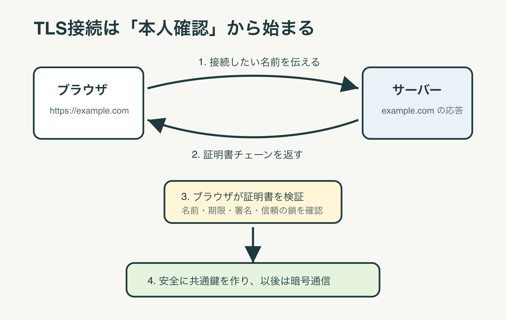
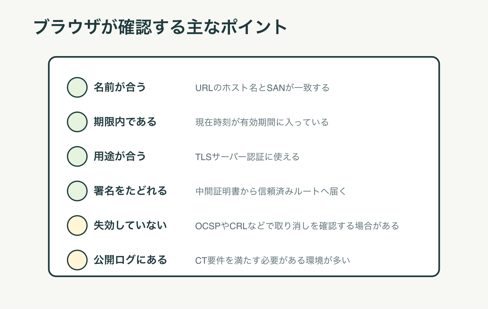
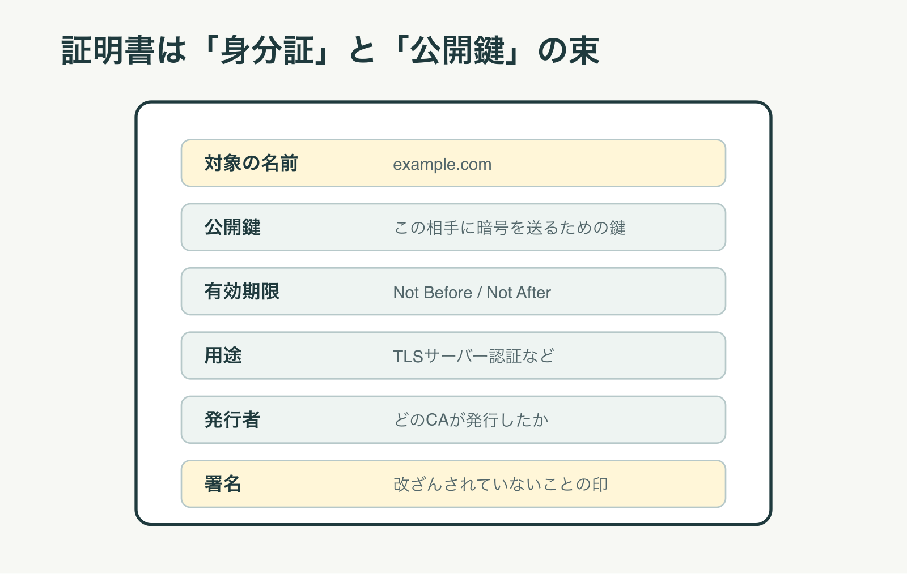
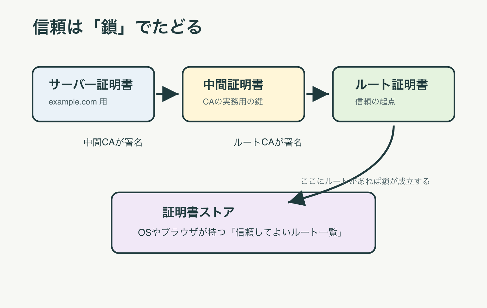
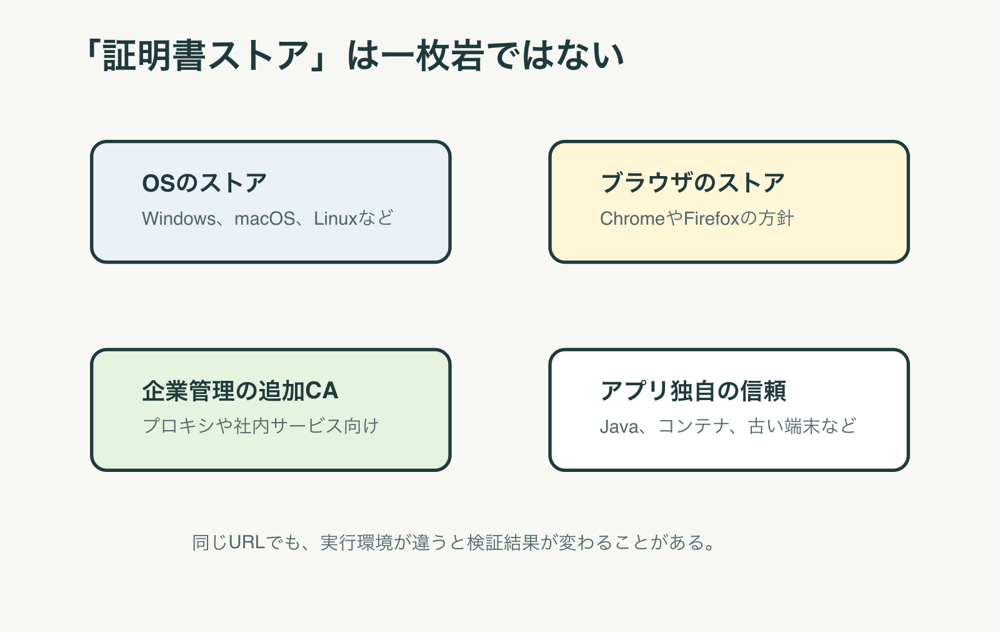
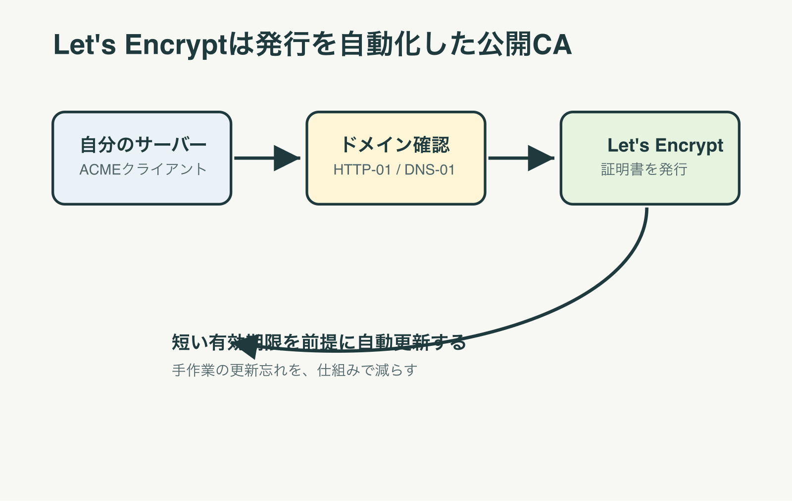
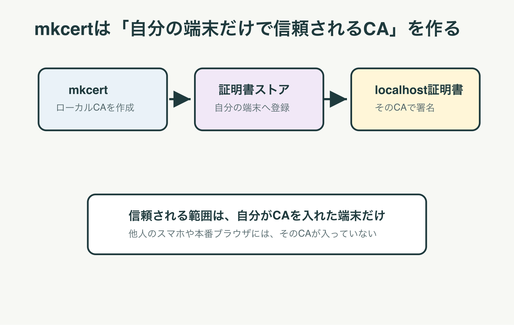
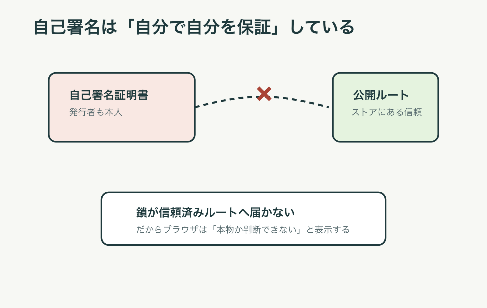
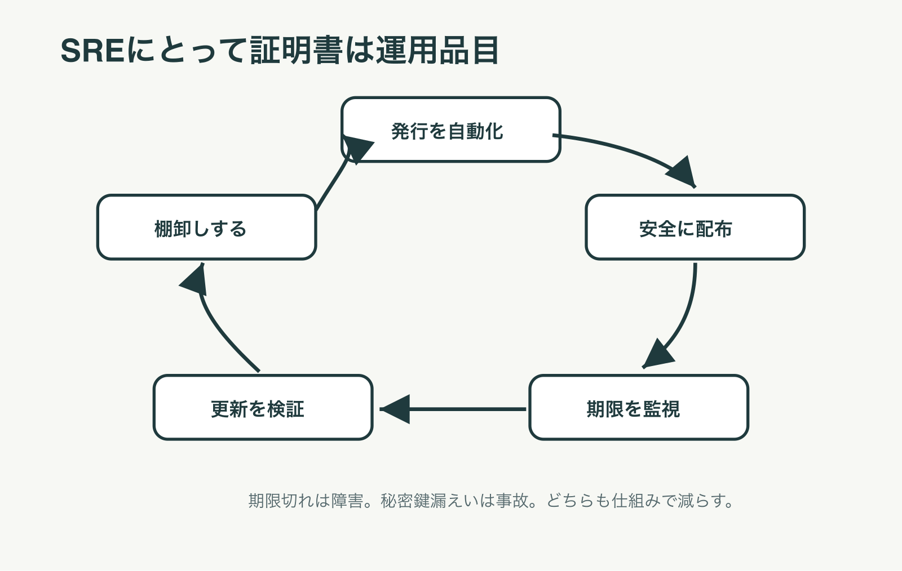
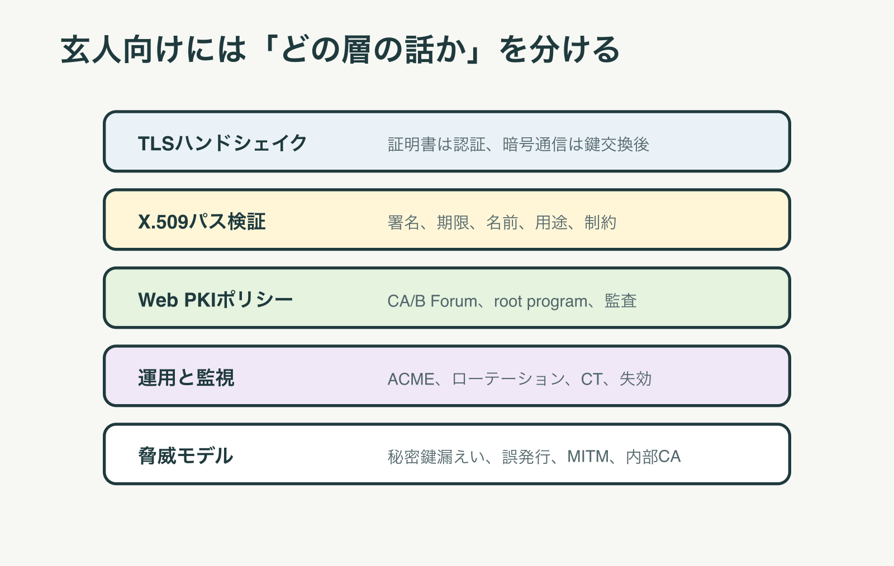

# TLS証明書のしくみが説明できる本
Codex

# 1. まず、証明書は何をしているのか
インターネットで買い物をするとき、ブラウザのアドレス欄には `https://` が表示される。

多くの人は、それを見ると何となく安心する。

しかし、HTTPSが守っているものは一つではない。

大きく分けると、三つある。

一つ目は、通信相手の確認である。

あなたが `example.com` に接続したつもりなら、本当に `example.com` のサーバーと話しているのかを確認する。

二つ目は、通信内容の暗号化である。

途中のネットワーク機器やWi-Fiの利用者に、中身を読まれにくくする。

三つ目は、通信内容の改ざん検出である。

途中で内容が書き換えられたら、ブラウザやサーバーが気づけるようにする。

このうち、TLS証明書が主に担当するのは、最初の**通信相手の確認**である。

暗号化そのものは、TLSのハンドシェイクで作られる共通鍵によって行われる。

証明書は、その鍵交換を始める前に、相手が名乗っている名前を信じてよいかを判断するための材料になる。

## 身分証に似ているが、完全には同じではない
TLS証明書は、よく身分証にたとえられる。

これはよい入り口である。

証明書には、どの名前のための証明書か、誰が発行したか、いつまで有効か、どの公開鍵を使うかが書かれている。

ブラウザはそれを見て、このサーバーは本当にその名前を名乗ってよい相手なのかを判断する。

ただし、人間の身分証とは違う点もある。

運転免許証なら、顔写真と本人を見比べる。

TLS証明書では、ブラウザは人間の顔を見ない。

見るのは、URLのホスト名、証明書内の名前、署名、発行者、有効期限、用途、失効情報、証明書ストアである。

つまり、証明書は「この人がいい人です」という保証ではない。

「この公開鍵は、このドメイン名のために使われるものとして、信頼された発行者が確認しました」という証明である。

ここを取り違えると、HTTPSの意味を過大評価してしまう。

HTTPSのサイトでも、詐欺サイトは作れる。

証明書が証明するのは、基本的には**接続先の名前と鍵の対応**であり、その会社が善良かどうかではない。

## SSLとTLSは何が違うのか
日常会話では、いまでも「SSL証明書」という言葉が使われる。

しかし、現代のWebで実際に使われているのはTLSである。

SSLは古いプロトコル名で、現在は安全ではない。

TLSはその後継であり、2026年時点の標準的な通信ではTLS 1.2またはTLS 1.3が中心である。

それでも業界では「SSL証明書」という名前が残った。

これは、古い呼び名が商品名や慣用句として残っているだけだと考えるとよい。

本書では、仕組みとしてはTLS証明書と呼ぶ。

# 2. ブラウザは何を見て「正しい」と判断するのか
ブラウザは、証明書を一枚見て終わりにしているわけではない。

実際には、いくつもの条件を順番に確認している。

その結果として、アドレス欄に警告を出すか、普通にページを表示するかを決める。

この判断は、ブラウザ単体だけで完結しないこともある。

OSの証明書ストア、ブラウザ自身の証明書ストア、企業の管理ポリシー、失効確認、Certificate Transparencyの要件などが関わる。

とはいえ、素人向けには、まず次の順番で理解すれば十分である。

## 名前が合っているか
最初に見るのは名前である。

あなたが `https://www.example.com` を開いたなら、証明書には `www.example.com` が入っていなければならない。

現在の証明書では、主にSANという欄に名前が入る。

SANはSubject Alternative Nameの略である。

昔はCommon Nameという欄もよく使われたが、現代の検証ではSANが中心である。

もし証明書が `example.net` 用なら、たとえ暗号としては正しくても、`www.example.com` には使えない。

ブラウザは、名前が違うという警告を出す。

これは郵便物に似ている。

封筒が本物でも、宛名が違えば、その人のものとは言えない。

証明書でも、発行者が信頼できても、対象の名前が合わなければ失敗する。

## 期限内か
証明書には有効期間がある。

開始日時と終了日時があり、ブラウザは現在時刻がその範囲に入っているかを見る。

期限切れの証明書は、基本的に信用されない。

期限切れは、SREやインフラ担当者にとって典型的な障害原因である。

サイトの中身は正常でも、証明書だけが切れていれば、利用者のブラウザには大きな警告が出る。

また、端末側の時計が大きくずれていても問題が起きる。

実際には証明書が有効でも、クライアント端末が過去や未来の時刻を信じていれば、期限外と判断されることがある。

## 発行者の署名をたどれるか
証明書には、発行者による署名がある。

署名とは、ざっくり言えば「この内容を、この発行者が認めた」という改ざん検出つきの印である。

ブラウザは、その署名を確認する。

ただし、発行者の名前が書かれているだけでは足りない。

発行者の証明書も確認し、その発行者がさらに誰に信頼されているのかをたどる。

この連なりを証明書チェーンと呼ぶ。

チェーンの最後が、OSやブラウザの証明書ストアに入っている信頼済みルート証明書まで届くと、信頼の道筋ができる。

途中で切れていれば、ブラウザは判断できない。

## 用途が合っているか
証明書には、何に使ってよいかを示す情報も入っている。

WebサーバーのTLS認証に使うなら、TLSサーバー認証に使える証明書でなければならない。

コード署名用の証明書やメール用の証明書を、Webサーバー証明書として使うことはできない。

この用途制限は、証明書の世界では重要である。

鍵そのものは似ていても、使い道が違えば信頼してはいけない。

## 取り消されていないか
証明書は、有効期限内でも取り消されることがある。

たとえば秘密鍵が漏えいした場合である。

秘密鍵を盗まれたら、攻撃者がその証明書を使って本物のサーバーになりすます危険がある。

そのため、CAは証明書を失効させる。

失効の確認には、CRLやOCSPという仕組みがある。

ただし、ブラウザの失効確認は環境や実装によって挙動が違う。

すべての場面でオンライン確認が厳密に行われるわけではない。

だからこそ、証明書の有効期限を短くし、自動更新を前提にする流れが強くなっている。

## Certificate Transparencyを満たしているか
近年のWeb PKIでは、Certificate Transparencyも重要である。

これは、発行された公開TLS証明書をログに記録し、あとから監視できるようにする仕組みである。

もしCAが誤って他人のドメインの証明書を発行してしまっても、ログに出れば発見しやすくなる。

ChromeやAppleプラットフォームでは、公開TLS証明書がCT要件を満たすことが信頼判断に関わる。

利用者から見ると、これは裏側の仕組みである。

しかし、運用者から見ると、証明書が正しく発行されていても、CT要件を満たさないとブラウザで警告される可能性がある。

# 3. 証明書の中身を読む
証明書は、ただの暗号ファイルではない。

人間が読める形に展開すると、いくつもの項目が入っている。

ここでは、最低限知っておきたい項目だけを見る。

## SubjectとSAN
Subjectは、証明書の対象を示す欄である。

ただし、Webサーバー証明書では、実際のホスト名検証にはSANが重要である。

SANには、DNS名やIPアドレスが入る。

たとえば、`example.com` と `www.example.com` の両方で使いたいなら、両方をSANに入れる必要がある。

ワイルドカード証明書では、`*.example.com` のような名前を使う。

これは `www.example.com` や `api.example.com` には使える。

しかし、通常は `a.b.example.com` のような二段深いサブドメインまでは覆わない。

## 公開鍵
証明書には公開鍵が入っている。

公開鍵は公開してよい鍵である。

それに対応する秘密鍵は、サーバー側が厳重に守る。

TLSでは、サーバーは秘密鍵を使って、自分が証明書に書かれた公開鍵の持ち主であることを示す。

TLS 1.3では、通信の暗号化に使う共通鍵は、主に一時的な鍵交換によって作られる。

証明書の鍵は、通信相手を認証する役割が中心になる。

ここは誤解されやすい。

証明書に公開鍵があるからといって、その鍵だけで通信全文を暗号化しているわけではない。

公開鍵暗号は、本人確認と安全な鍵交換の入口として使われる。

実際の大量データの暗号化には、速い共通鍵暗号が使われる。

## Issuer
Issuerは発行者である。

たとえばLet's Encryptで発行した証明書なら、発行者としてLet's Encryptの中間CAが出てくる。

ブラウザは、その発行者の証明書をさらに確認する。

発行者の発行者をたどり、最後に信頼済みルートへ届くかを見る。

## Not BeforeとNot After
Not Beforeは、この時刻より前は使えないという意味である。

Not Afterは、この時刻を過ぎたら使えないという意味である。

証明書の期限切れ障害は、Not Afterを過ぎた状態で起きる。

一方、Not Beforeより前に使ってしまっても失敗する。

発行直後の証明書が一部端末でまだ使えないように見える場合、端末時刻やタイムゾーン、配布タイミングを疑うことがある。

## Key UsageとExtended Key Usage
Key Usageは、その鍵を何に使えるかを示す。

Extended Key Usageは、さらに具体的な用途を示す。

Webサーバーの証明書なら、TLS Web Server Authenticationに相当する用途が必要になる。

中間CAの証明書なら、証明書を発行するためのCAとしての用途が必要になる。

この用途制限がなければ、ある目的で発行された証明書が別の目的に悪用されやすくなる。

## Basic Constraints
Basic Constraintsは、その証明書がCA証明書かどうかを示す重要な項目である。

一般のサーバー証明書は、他の証明書を発行してはいけない。

中間CAやルートCAは、証明書を発行できる。

つまり、CAであることを示す制約が必要になる。

ブラウザはこの制約も検証する。

もし普通のサーバー証明書が勝手に別の証明書へ署名しても、それは信頼されない。

# 4. 中間証明書とは何か
中間証明書は、ルート証明書とサーバー証明書の間に置かれる証明書である。

初心者には、ここが一番わかりにくい。

なぜルートCAが直接すべてのサーバー証明書を発行しないのか。

答えは、ルートCAの秘密鍵を守るためである。

ルートCAは信頼の起点である。

もしルートCAの秘密鍵が漏れたら、その影響は非常に大きい。

世界中の端末がそのルートを信頼しているなら、そのルート配下の信頼全体が揺らぐ。

そのため、ルートCAの秘密鍵は厳重に保管され、日常の発行業務には使われないことが多い。

代わりに、ルートCAが中間CAへ署名する。

中間CAが、実際のサーバー証明書を発行する。

## 中間証明書はサーバーが送る
通常、Webサーバーは自分のサーバー証明書だけでなく、中間証明書も一緒に送る。

ブラウザはそれを使って、チェーンを組み立てる。

サーバーが中間証明書を送らないと、ブラウザがチェーンを作れずに失敗することがある。

一部のブラウザやOSは、足りない中間証明書を自動で補える場合がある。

しかし、すべてのクライアントがそうではない。

そのため、サーバー設定では、サーバー証明書と中間証明書を含むフルチェーンを設定するのが基本である。

Let's Encryptであれば、`cert.pem` ではなく `fullchain.pem` をWebサーバーへ設定する場面が多い。

これはSREの現場でよくあるミスである。

ローカルのブラウザでは動くのに、一部のJavaクライアントや古い端末で失敗する。

その原因が、中間証明書の不足であることは珍しくない。

## ルート証明書は普通サーバーが送らない
サーバーは、通常、ルート証明書までは送らない。

なぜなら、ルート証明書はクライアント側の証明書ストアに入っているべきものだからである。

サーバーが「このルートを信じてください」と送ってきても、それだけで信じるなら攻撃者も同じことができてしまう。

信頼の起点は、サーバーから受け取るのではなく、OSやブラウザの配布元が管理するストアから来る。

ここが証明書の核心である。

信頼は、通信相手からもらうものではない。

あらかじめ自分の端末が持っている信頼から始まる。

# 5. 証明書ストアとは何か
証明書ストアとは、端末やブラウザが持っている「信頼してよいルート証明書の一覧」である。

ルート証明書は、誰でも作れる。

しかし、誰でも作れるものを全員が信じたら、認証にならない。

そこで、OSベンダーやブラウザベンダーは、信頼するルートCAを審査し、ストアに入れる。

Microsoft、Apple、Mozilla、Googleなどが、それぞれルートプログラムや証明書方針を持っている。

CAは、監査を受け、ルールに従い、事故があれば報告し、問題が大きければストアから外される。

## OSのストアとブラウザのストア
証明書ストアは、一つだけではない。

WindowsにはWindowsの信頼ストアがある。

macOSやiOSにはAppleの仕組みがある。

FirefoxはMozillaのルートストアを使うのが基本である。

Chromeも近年、Chrome Root StoreとChrome Certificate Verifierによって、より一貫した検証を進めている。

ただし、企業管理の設定やOS、ブラウザ、バージョンによって実際の挙動は変わる。

だから、証明書トラブルでは「自分のブラウザでは見える」だけでは不十分である。

利用者が使うOS、ブラウザ、アプリ、古い端末、Java実行環境、コンテナ内のCAバンドルまで見る必要がある。

## 企業の追加CA
企業では、社内プロキシや社内サービスのために、独自のルートCAを端末へ配布することがある。

これを入れると、その企業CAが発行した証明書を端末が信頼するようになる。

これは便利だが、強い権限でもある。

そのCAの秘密鍵を持つ者は、社内端末に対して多くのHTTPS通信を中継できる可能性がある。

そのため、企業CAは厳格に管理する必要がある。

便利だからといって、誰でも触れる場所に置いてはいけない。

証明書ストアへルートCAを追加する行為は、端末の信頼判断を変える行為である。

これはソフトウェアをインストールするより重い場合がある。

## ストアにないCAは信頼されない
自己署名証明書や自作CAがインターネットの一般利用者から信頼されないのは、このためである。

あなたのPCにだけ自作CAを入れれば、あなたのPCでは信頼される。

しかし、他人のスマホ、会社のPC、検索エンジンのクローラー、外部APIのクライアントには、そのCAが入っていない。

だから、世界中の一般利用者に警告なしでアクセスしてもらうには、公開ルートストアに信頼されたCAから証明書を発行してもらう必要がある。

# 6. Let's Encryptとは何か
Let's Encryptは、無料で自動化されたTLS証明書を発行する公開CAである。

運営しているのはInternet Security Research Groupである。

Let's Encryptが普及する前、HTTPS証明書の取得は今より面倒だった。

費用がかかり、手続も手作業が多く、更新忘れも起きやすかった。

Let's Encryptは、ACMEという標準プロトコルを使い、ドメイン所有の確認、証明書発行、更新を自動化した。

これにより、個人サイトや小規模サービスでもHTTPSを使いやすくなった。

## Let's Encryptが確認していること
Let's Encryptが主に発行するのはDV証明書である。

DVはDomain Validationの略である。

これは、その申請者がドメインを制御できることを確認する種類の証明書である。

たとえば、HTTP-01チャレンジでは、指定されたURLに特定の内容を置けるかを確認する。

DNS-01チャレンジでは、DNSに指定されたTXTレコードを置けるかを確認する。

どちらも、ドメインを操作できる人なら対応できる。

反対に言えば、Let's Encryptはその会社の実在性や営業内容まで深く審査しているわけではない。

だから、詐欺サイトでも、自分のドメインを持っていればHTTPS化できる。

この事実は、HTTPSの意味を理解するうえで重要である。

HTTPSは通信路を守る。

しかし、リンク先の事業者が信用できるかどうかは、別に判断しなければならない。

## 90日証明書の意味
Let's Encryptの証明書は有効期間が短い。

典型的には90日である。

これは不便に見えるが、手作業ではなく自動更新を前提にすると合理的である。

秘密鍵漏えいや誤発行があっても、長期証明書より影響期間を短くできる。

また、更新を自動化すれば、担当者が退職した、メールを見落とした、手順書が古いといった人的ミスを減らせる。

近年のWeb PKI全体でも、証明書の有効期間を短くする方向へ進んでいる。

CA/Browser ForumのBaseline Requirementsは、公開TLS証明書の発行と管理に関する基準を更新し続けている。

2026年時点では、証明書ライフサイクルを人手ではなく機械で回すことが、より重要になっている。

## Let's Encryptも魔法ではない
Let's Encryptを使えば、すべての証明書問題が消えるわけではない。

DNSが間違っていれば発行できない。

HTTP-01のためのパスがリバースプロキシで塞がれていれば失敗する。

DNS-01のAPI権限が切れていれば更新できない。

Webサーバーに `fullchain.pem` ではなくサーバー証明書だけを設定すれば、一部クライアントでチェーン検証に失敗する。

自動更新に成功しても、サービスの再読み込みが走らなければ、古い証明書を出し続けることもある。

Let's Encryptは、証明書発行の入口を劇的に楽にした。

しかし、運用の責任は残る。

# 7. mkcertがやっていること
mkcertは、ローカル開発用の証明書を簡単に作るツールである。

開発中に `https://localhost` を使いたいことがある。

ブラウザのセキュアコンテキストが必要なAPIを試す場合や、本番と同じHTTPS前提の挙動を確認する場合である。

ここで、Let's Encryptを使えばよいと思うかもしれない。

しかし、`localhost` や `127.0.0.1` のような名前には、公開CAは通常のWeb PKI証明書を発行できない。

そこでmkcertが役に立つ。

## mkcertはローカルCAを作る
mkcertは、あなたの端末にローカルCAを作る。

そして、そのローカルCAのルート証明書を、あなたのOSやブラウザの証明書ストアへ登録する。

その後、`localhost` や任意の開発用ドメインの証明書を、そのローカルCAで発行する。

すると、あなたの端末では、その証明書が信頼される。

ブラウザから見ると、信頼済みルートへつながる証明書チェーンができるからである。

ここで大切なのは、信頼される範囲である。

mkcertで作った証明書は、あなたがローカルCAを入れた端末では信頼される。

しかし、他人の端末では信頼されない。

本番公開用の証明書ではない。

## mkcertの秘密鍵は強い
mkcertが作るローカルCAの秘密鍵は、強い権限を持つ。

なぜなら、そのCAはあなたの端末にとって信頼済みだからである。

もしその秘密鍵が漏れれば、あなたの端末に対して、攻撃者が信頼される証明書を作れる可能性がある。

したがって、mkcertのルートCA秘密鍵をGitにコミットしてはいけない。

チームで共有してはいけない。

CIや本番環境へ持ち込んでもいけない。

mkcertは、開発者個人の端末で、ローカル開発を楽にする道具である。

チーム共通の内部PKIとして使うものではない。

## Dockerやモバイル実機では別の注意がある
mkcertでホストOSにCAを入れても、Dockerコンテナの中にはそのCAが入っていないことがある。

コンテナ内のcurlやアプリがHTTPSで接続するなら、コンテナ側のCAバンドルにも信頼を入れる必要がある。

また、スマートフォン実機でローカル開発サーバーへアクセスする場合、そのスマートフォンにもローカルCAを入れなければ信頼されない。

ただし、モバイルOSはユーザー追加CAの扱いに制限がある。

アプリによっては、ユーザーが追加したCAを信頼しない設定になっている。

このように、証明書トラブルは「どの端末の、どのアプリが、どのストアを見ているか」で答えが変わる。

# 8. 自己署名証明書はなぜインターネットで使えないのか
自己署名証明書とは、自分で自分に署名した証明書である。

技術的には、誰でも作れる。

そして、暗号としての形式も証明書である。

しかし、ブラウザが信頼するかどうかは別問題である。

ブラウザは、証明書チェーンが信頼済みルートへ届くかを見る。

自己署名証明書は、自分自身が発行者である。

その自己署名証明書が証明書ストアに入っていない限り、信頼の起点にならない。

## 暗号化できることと、信頼できることは違う
自己署名証明書でも、通信を暗号化すること自体はできる。

しかし、相手が本物かどうかを確認できない。

たとえば、攻撃者があなたの通信を中継し、自分で作った自己署名証明書を出したとする。

もしブラウザがそれを無条件に信じるなら、攻撃者は簡単に中間者攻撃をできてしまう。

だから、ブラウザは自己署名証明書に警告を出す。

これは意地悪ではない。

認証の仕組みとして必要な防御である。

## 例外的に使える場面
自己署名証明書が常に悪いわけではない。

閉じた実験環境で、一時的に使うなら意味がある。

自分だけがアクセスする検証サーバーで、指紋を別経路で確認できるなら、使える場合もある。

組織内で独自CAを配布し、そのCAを各端末の証明書ストアへ入れているなら、そのCA配下の証明書は内部では信頼される。

しかし、それは公開インターネットで誰にでも信頼されるという意味ではない。

信頼されるには、クライアント側に信頼の起点が必要である。

世界中の一般利用者に警告なしで使ってもらうには、公開ルートストアに入っているCAから発行された証明書が必要になる。

# 9. 利用者の端末では実際に何が起きているのか
利用者がブラウザでHTTPSサイトを開くと、ブラウザはサーバーから証明書チェーンを受け取る。

そして、手元の信頼ストアを使って検証する。

このとき、サーバー側だけ見ていても答えが出ないことがある。

同じサーバーでも、WindowsのChrome、macOSのSafari、Firefox、Androidの古いWebView、Javaアプリでは結果が違うことがある。

## ブラウザ経由の場合
ブラウザ経由では、ユーザーがアクセスしたURLのホスト名が重要になる。

ブラウザはSNIによって、接続先ホスト名をTLSハンドシェイクの早い段階でサーバーへ伝える。

サーバーは、その名前に対応する証明書を返す。

一台のサーバーで複数ドメインを扱えるのは、このSNIのおかげである。

もしSNI設定が間違っていると、別ドメインの証明書を返してしまい、名前不一致で失敗する。

CDNやロードバランサ、Ingress、リバースプロキシを使っている環境では、この設定ミスがよく起きる。

## OSが見るもの
OSは、証明書ストアを提供することがある。

アプリはOSのAPIを使って証明書検証を行う場合がある。

WindowsならMicrosoftのルート証明書プログラムに基づくルートが配布される。

AppleプラットフォームならAppleのルートプログラムとシステムの信頼設定が関わる。

LinuxではディストリビューションのCAバンドルや更新状況が影響する。

ただし、アプリが必ずOSのストアを見るとは限らない。

Firefoxのように独自のルートストアを持つブラウザもある。

Javaのように独自のキーストアを使う実行環境もある。

コンテナ内では、ホストOSとは別のCAバンドルを持つ。

そのため、証明書障害では「OSには入れたのにアプリが信頼しない」ということが起きる。

## ユーザー追加CAの扱い
企業や開発環境では、ユーザーが追加したCAを使うことがある。

しかし、すべてのアプリがユーザー追加CAを信頼するわけではない。

モバイルアプリでは、セキュリティ上の理由から、ユーザー追加CAを無視する設定にしていることがある。

証明書ピンニングをしているアプリでは、OSが信頼していても、アプリが期待する証明書や公開鍵でなければ拒否されることがある。

これは不具合ではなく、アプリ側の脅威モデルである。

証明書検証は、OS、ブラウザ、アプリの境界にまたがる。

そのため、トラブルシュートでは、どの層で拒否されたのかを分けて考える必要がある。

# 10. SREがインプットすべき証明書運用
ここからは、SREやインフラ担当者が押さえるべき内容に進む。

初心者向けの理解では、証明書は「信頼の鎖」である。

SRE向けには、それに加えて、証明書は**期限と秘密鍵を持つ運用品目**だと捉える必要がある。

## 棚卸しが最初である
証明書運用で最初に必要なのは棚卸しである。

どのドメインに、どの証明書が、どこで使われているか。

それを把握しなければ、自動更新も監視もできない。

典型的には、次の場所に証明書が散らばる。

ロードバランサ。

CDN。

Kubernetes Ingress。

API Gateway。

Webサーバー。

メールサーバー。

社内プロキシ。

監視基盤。

古い管理画面。

一見Webとは関係なさそうな機器にも、TLS証明書は入っている。

証明書管理は、ドメイン管理、DNS管理、秘密鍵管理、デプロイ管理と一体で考える必要がある。

## 監視すべきもの
最低限、証明書の有効期限は監視する。

しかし、それだけでは足りない。

チェーンが正しく配信されているか。

期待したSANが入っているか。

鍵種別や署名アルゴリズムが想定どおりか。

失効していないか。

CTログに意図しない証明書が出ていないか。

更新後にサービスが新証明書を返しているか。

これらを監視対象にする。

特に、証明書更新は成功しても、プロセスが古い証明書をメモリに持ったままということがある。

ファイルは更新されたのに、nginxやEnvoyやJavaプロセスが再読み込みしていない。

この場合、ディスク上の証明書を見る監視では正常に見えるが、外から接続すると期限切れを出す。

外形監視が必要な理由である。

## 自動更新の設計
Let's EncryptやACMEを使うなら、自動更新の設計が重要である。

発行、配置、再読み込み、検証、ロールバックを一連の流れにする。

DNS-01を使うなら、DNS APIの権限を最小化する。

ワイルドカード証明書を使うなら、その秘密鍵の影響範囲を意識する。

Kubernetesではcert-managerがよく使われる。

ただし、cert-managerを入れただけで運用が完成するわけではない。

IssuerやClusterIssuerの権限、Secretの参照範囲、IngressやGatewayの設定、更新イベント後の反映を確認する必要がある。

## 秘密鍵の扱い
証明書そのものは公開情報である。

秘密にすべきなのは秘密鍵である。

秘密鍵が漏れた場合、その証明書は失効させ、再発行し、漏えい範囲を調査する。

鍵をGitに置いてはいけない。

ログに出してはいけない。

コンテナイメージに焼き込むのも避けたい。

Secret Manager、KMS、HSM、ロードバランサのマネージド証明書機能など、環境に合わせて保護する。

また、同じ秘密鍵を多くの場所へコピーすると、漏えい範囲が広がる。

ワイルドカード証明書は便利だが、一つの鍵が多くのサブドメインに効く。

便利さと影響範囲は表裏である。

## 失効対応
秘密鍵漏えいや誤発行が疑われる場合、証明書を失効させる。

しかし、失効は魔法の停止ボタンではない。

クライアントが失効情報を必ずリアルタイムに確認するとは限らない。

だから、失効に加えて、証明書差し替え、鍵交換、該当ホストの遮断、監査ログ確認、CT監視、利用者影響の評価が必要になる。

短命証明書を使うことは、失効確認の不確実さを補う一つの考え方である。

## インシデントとして扱う基準
次のような場合は、単なる設定ミスではなく、インシデントとして扱うべきである。

秘密鍵が漏えいした可能性がある。

本番とは異なる証明書を誤って配信した。

意図しないドメインの証明書がCTログに出た。

CAアカウントやDNS APIトークンが漏えいした。

期限切れにより主要サービスが利用不能になった。

証明書運用は、可用性とセキュリティの両方に関わる。

SREは、障害対応とセキュリティ対応を分けずに設計する必要がある。

# 11. 玄人向けの段落
ここからは、より深い説明をするための段落である。

人に説明できるレベルを超えて、実装や標準を読む入口になる内容を扱う。

## TLS 1.3における証明書の位置づけ
TLS 1.3では、ハンドシェイクの早い段階で鍵共有が行われる。

その後、サーバーは証明書を提示し、CertificateVerifyでハンドシェイク transcript に対する署名を行う。

これにより、サーバーは証明書に対応する秘密鍵を持っていることを示す。

重要なのは、証明書の公開鍵がそのままアプリケーションデータの暗号化鍵になるわけではないことだ。

通信の機密性は、一時鍵交換から導かれるセッション鍵によって守られる。

証明書は、鍵交換の相手が期待したドメインの主体であることを確認するために使われる。

この分離により、前方秘匿性が得られる。

仮にサーバー証明書の秘密鍵が後日漏えいしても、過去の通信のセッション鍵が直ちに復元される設計ではない。

ただし、これは安全な鍵交換と実装が前提である。

## X.509パス検証は単純な文字列比較ではない
X.509証明書の検証は、RFC 5280に基づくパス検証の問題である。

クライアントは、提示された証明書から信頼アンカーまでの認証パスを構築し、各証明書の署名、有効期間、Basic Constraints、Key Usage、Extended Key Usage、Name Constraints、Policy Constraintsなどを検証する。

実装によって、パス構築の探索方法や、提示されなかった中間証明書の取得方法が違うことがある。

この差が、あるクライアントでは成功し、別のクライアントでは失敗する原因になる。

特に、クロス署名、古いルート、複数の可能なチェーンがある場合、クライアントが選ぶパスによって結果が変わることがある。

Let's Encryptの歴史でも、ISRG Root X1、ISRG Root X2、古いクロス署名チェーン、Android互換性などが実務上の論点になった。

チェーンは一列に見えても、実際の検証ではグラフ探索に近い側面がある。

## Web PKIは暗号だけではなく制度である
Web PKIは、暗号アルゴリズムだけで成り立っていない。

CA/Browser ForumのBaseline Requirements、各ルートストアプログラム、監査、インシデント報告、Certificate Transparency、失効運用、ブラウザ側のポリシーが組み合わさっている。

CAが技術的に証明書を発行できることと、公開TLS証明書として受け入れられることは違う。

公開信頼を得るには、ルートストアに含まれ、継続的にポリシーへ従い、監査と透明性の要件を満たす必要がある。

この意味で、TLS証明書は暗号技術であると同時に、運用制度でもある。

## CTは誤発行を防ぐのではなく発見しやすくする
Certificate Transparencyは、CAが誤発行しないことを保証する仕組みではない。

発行された証明書を公開ログへ記録し、ドメイン所有者や監視者が発見できるようにする仕組みである。

CTログは追記専用の構造を持ち、SCTという証拠を証明書やOCSPやTLS拡張でクライアントへ提示する。

ブラウザは、証明書がCTポリシーを満たすかを確認する。

運用者は、自分のドメインに対して意図しない証明書が発行されていないかを監視できる。

つまりCTは、信頼を完全に置き換えるものではない。

信頼されたCAに対する監視可能性を上げる仕組みである。

## 失効確認の難しさ
証明書失効は、長年難しい問題である。

CRLは大きくなりやすく、クライアントが毎回取得すると重い。

OCSPはオンライン問い合わせを必要とし、プライバシーや可用性の問題を持つ。

OCSP Staplingは、サーバーがOCSP応答を添付することで改善するが、運用と対応状況に依存する。

ブラウザは、独自の失効リストや短命証明書、CT、ポリシー enforcement を組み合わせている。

そのため、「失効すれば即座に全世界で拒否される」と考えるのは危険である。

SREは、失効に頼りすぎず、短命化、自動更新、鍵漏えい時の即時差し替え、監視を組み合わせるべきである。

## 内部PKIと公開Web PKIを混ぜない
社内サービスには内部PKIが有効である。

mTLS、サービスメッシュ、ゼロトラストネットワーク、デバイス認証では、公開Web PKIとは別の信頼モデルを使うことが多い。

しかし、内部CAを公開向け証明書のように扱うと混乱する。

内部CAは、配布した端末やワークロードだけが信頼する。

公開Web PKIは、一般利用者の端末にあらかじめ配布されたルートストアを前提にする。

この二つは、対象クライアントも監査要件も失効運用も違う。

開発環境のmkcert、社内CA、公開CA、クラウドのマネージド証明書を同じ箱で語ると、設計ミスが起きる。

# 12. よくある証明書トラブルの読み解き方
証明書の理解は、エラーを読めるようになると一気に深まる。

ブラウザやコマンドラインツールのエラー文は、最初は怖く見える。

しかし、多くは同じ型に分けられる。

型を知っていれば、原因を絞り込める。

ここでは、現場でよく見る失敗を順番に見る。

## 名前が違う
名前不一致は、もっとも基本的な失敗である。

たとえば、利用者は `https://api.example.com` にアクセスしているのに、サーバーが `www.example.com` 用の証明書を返している。

この場合、証明書が期限内でも、信頼されたCAから発行されていても、ブラウザは警告する。

原因として多いのは、ロードバランサやIngressのSNI設定ミスである。

複数ドメインを一つの入口で扱う構成では、どのホスト名にどの証明書を返すかを明確に設定しなければならない。

CDNを使っている場合は、オリジン側とCDN側で別々の証明書があることも多い。

利用者が見るのはCDN側の証明書である。

オリジンの証明書だけ直しても、利用者のエラーは消えないことがある。

## 期限が切れている
期限切れは単純だが、影響が大きい。

証明書のNot Afterを過ぎると、ブラウザは接続を危険と判断する。

期限切れの怖さは、サービス本体が健康でも発生する点にある。

アプリケーションのCPU使用率、DB接続、HTTPのヘルスチェックがすべて正常でも、TLS入口だけで止まる。

このため、証明書期限はアプリケーション監視とは別に監視する。

さらに、外部から実際に接続して、返ってくる証明書の期限を見る。

ファイル上の証明書だけ見ても十分ではない。

プロセスが古い証明書を握っていることがあるからである。

## 中間証明書が足りない
中間証明書不足は、厄介な失敗である。

あるブラウザでは成功し、別のクライアントでは失敗することがある。

成功する環境は、中間証明書をキャッシュしていたり、自動で取りに行けたりする。

失敗する環境は、サーバーから送られてきたチェーンだけで検証しようとして、信頼済みルートへ届かない。

この問題は、サーバーへサーバー証明書だけを設定したときに起きやすい。

Webサーバーやロードバランサには、サーバー証明書と中間証明書を含むフルチェーンを設定する。

Let's Encryptの場合、`fullchain.pem` を使う理由がここにある。

## ルートが古い
古い端末では、最新のルート証明書を持っていないことがある。

証明書チェーンが新しいルートへ向いていると、古いOSや組み込み機器で失敗する。

Let’s Encryptでも、ルートや中間証明書の移行時に、古い端末との互換性が話題になった。

この問題は、サーバー設定だけで完全には解決できない場合がある。

クライアント端末の更新が必要になることもある。

一方で、CAが提供する代替チェーンを選べる場合もある。

ただし、互換性のために古いチェーンを選ぶと、別の環境で問題が出ることもある。

証明書チェーンは、単に新しければよいわけではない。

利用者の実行環境を見て判断する。

## 社内プロキシでだけ失敗する
企業ネットワークでは、TLSインスペクションを行うプロキシが入っていることがある。

この場合、ブラウザが見ている証明書は、外部サイトが出した証明書ではない。

社内プロキシが発行した別の証明書である。

端末に社内CAが入っていれば、ブラウザはそれを信頼する。

入っていなければ警告になる。

これは、ネットワークの途中でHTTPSをいったん復号し、検査してから再暗号化する構成である。

セキュリティ製品や企業の監査目的で使われることがある。

ただし、アプリによっては証明書ピンニングや独自の検証により、社内CAを信頼しない。

その場合、ブラウザでは見えるのにアプリだけ失敗する。

原因はサーバー側ではなく、企業ネットワークとアプリ側の信頼モデルにある。

## DNSは合っているのに証明書が違う
DNSを修正した直後、証明書が想定と違うことがある。

これは、DNSの伝播、CDNの設定反映、ロードバランサの証明書割り当て、SNIのホスト名、キャッシュが絡むためである。

証明書はDNSの結果だけで決まらない。

クライアントがどのIPへ接続し、TLSでどのSNIを送り、入口がどの証明書を選ぶかで決まる。

そのため、トラブル時は、名前解決、TCP接続先、SNI、返却証明書を分けて確認する。

一つの画面だけを見て判断すると、原因を見誤る。

# 13. 確認コマンドを読むための考え方
証明書トラブルを調べるとき、コマンドを丸暗記する必要はない。

何を見たいのかを決めれば、コマンドの意味が分かる。

ここでは、代表的な観点を説明する。

## 外から見える証明書を見る
まず見るべきなのは、利用者から見える証明書である。

サーバー上のファイルではなく、外部から接続したときに返ってくる証明書を見る。

このとき、SNIを指定することが重要である。

SNIなしで接続すると、サーバーがデフォルト証明書を返すことがある。

その結果、実際のブラウザ挙動と違うものを見てしまう。

確認したいのは、主に次の点である。

1. 返ってきた証明書のSubjectとSAN。
2. Not BeforeとNot After。
3. Issuer。
4. サーバーが送っている中間証明書。
5. チェーンがどのルートへ向かっているか。

SREは、これを手元の確認だけでなく、監視として定期実行できる形にする。

## ローカルファイルを見る
次に、サーバー上の証明書ファイルを見る。

これは、配置されたファイルが期待どおりかを確認するためである。

ただし、ファイルが正しいことと、サービスがそれを使っていることは別である。

証明書ファイルを更新したあと、プロセス再読み込みに失敗していれば、外からは古い証明書が見える。

したがって、ローカルファイル確認と外形確認はセットで行う。

## チェーンを検証する
チェーン検証では、サーバー証明書、中間証明書、信頼済みルートのつながりを見る。

検証に失敗したときは、どこで切れているかを探す。

中間証明書が足りないのか。

ルートがクライアントのストアにないのか。

用途制限やBasic Constraintsが不正なのか。

名前が合わないのか。

同じ「証明書エラー」でも、原因はまったく違う。

エラー文を見たら、まず名前、期限、チェーン、用途、失効のどれかに分類する。

## コンテナとJavaを忘れない
本番障害では、ブラウザではなくアプリケーション同士の通信で証明書エラーが出ることも多い。

この場合、ブラウザで見えるかどうかは参考にしかならない。

コンテナ内のCAバンドルが古い。

Javaのtruststoreに社内CAが入っていない。

AlpineベースのイメージでCAパッケージが不足している。

プロキシ経由の通信だけ別証明書になる。

こうした要因を切り分ける必要がある。

証明書検証は、実行環境の中で行われる。

ホストOSで信頼できても、コンテナやアプリが信頼するとは限らない。

# 14. 設計するときの判断軸
証明書を使う設計では、最初に公開向けか内部向けかを分ける。

この分岐を間違えると、あとから無理が出る。

公開インターネットで一般利用者がアクセスするなら、公開Web PKIを使う。

内部サービス、開発環境、サービス間通信なら、内部PKIやクラウドのマネージド証明書を検討する。

## 公開サイト
公開サイトでは、利用者の端末を管理できない。

そのため、利用者の端末に最初から入っている証明書ストアを前提にする。

Let's Encrypt、クラウドのマネージド証明書、商用CAなど、公開信頼されたCAから証明書を発行する。

自己署名証明書や社内CAは使わない。

証明書の取得と更新は自動化する。

ロードバランサやCDNで終端するなら、そこが返す証明書を監視する。

オリジンとの通信もHTTPSにするなら、オリジン証明書の信頼モデルも別途決める。

## 社内Webサービス
社内Webサービスでは、対象クライアントを管理できるかが分かれ目になる。

会社配布PCだけが使うなら、社内CAを端末へ配布できる。

しかし、個人端末や外部委託先、モバイルアプリも使うなら、公開CAを使うほうが簡単なことがある。

社内サービスだから内部CA、と決めつけない。

利用者端末を誰が管理しているかで決める。

## 開発環境
開発環境では、mkcertが便利である。

ただし、開発者個人の端末に閉じる場合に向いている。

チーム共有の検証環境や、他部署がアクセスするステージング環境では、公開CAや組織の内部CAを使うほうがよい。

開発用のローカルCA秘密鍵を共有する運用は避ける。

それは便利に見えて、信頼の境界を壊す。

## サービス間通信
サービス間通信では、mTLSを使うことがある。

mTLSでは、サーバーだけでなくクライアントも証明書を提示する。

これにより、サーバーは接続してきた相手が期待したクライアントかを確認できる。

サービスメッシュでは、この仕組みが自動化されていることがある。

ただし、mTLSを入れると、証明書発行、ローテーション、失効、時刻同期、監視の複雑さも増える。

認証を強くするなら、運用も強くしなければならない。

# 15. 構成別に見る証明書の置き場所
証明書は、どこでTLSを終端するかによって管理場所が変わる。

終端とは、TLS通信を復号してHTTPとして扱う場所である。

同じWebサービスでも、TLSをCDNで終端するのか、ロードバランサで終端するのか、アプリケーションサーバーで終端するのかで、設計が変わる。

証明書トラブルでは、まず「利用者が見ている証明書はどこのものか」を確認する。

## CDNで終端する場合
CDNを使う場合、利用者のブラウザが直接見る証明書はCDN側の証明書である。

自分のオリジンサーバーに設定した証明書ではない。

CDNがマネージド証明書を提供しているなら、CDN側で発行、更新、配信が行われる。

この構成では、公開向けの証明書運用をかなり簡単にできる。

ただし、オリジンとの通信をどう守るかは別問題である。

CDNからオリジンへHTTPでつなぐのか、HTTPSでつなぐのか。

HTTPSでつなぐなら、オリジン証明書を公開CAにするのか、CDNが信頼する専用証明書にするのか。

ここを曖昧にすると、利用者側は安全に見えても、CDNとオリジンの間が弱くなる。

また、CDNには証明書の反映時間がある。

証明書を追加した直後やSANを変更した直後は、全エッジに反映されるまで時間がかかることがある。

障害時には、どのエッジで何が返っているかを見る必要がある。

## ロードバランサで終端する場合
クラウドのロードバランサでTLSを終端する構成は一般的である。

この場合、証明書はロードバランサの設定として管理される。

クラウドのマネージド証明書を使えば、自動更新されることが多い。

一方、自分で証明書をアップロードする場合は、期限監視と差し替えが必要になる。

ロードバランサで終端すると、バックエンドのアプリケーションにはHTTPで渡す構成もできる。

内部ネットワークを信頼する設計なら簡単である。

しかし、ゼロトラストや多テナント環境では、ロードバランサからバックエンドまで再度HTTPSにすることもある。

このとき、外側の証明書と内側の証明書は別物である。

外側は公開CA。

内側は内部CA。

このように分ける設計は自然である。

ただし、監視も二重に必要になる。

外から見える証明書だけでなく、ロードバランサからバックエンドへ接続したときの証明書も監視する。

## Kubernetes Ingressで終端する場合
Kubernetesでは、IngressやGatewayでTLSを終端することが多い。

cert-managerを使えば、ACMEによる証明書発行と更新を自動化できる。

ただし、仕組みが増える分、見るべき場所も増える。

Certificateリソース。

IssuerまたはClusterIssuer。

Secret。

IngressまたはGateway。

DNSレコード。

ACMEチャレンジ用の一時リソース。

これらのどこかが崩れると、証明書更新に失敗する。

特にDNS-01では、DNS APIの認証情報が必要になる。

その権限は最小限にする。

全ゾーンを書き換えられる強いトークンを、広いnamespaceから読めるSecretに置くのは危険である。

また、Ingress ControllerがSecret更新を自動で拾うかも確認する。

証明書Secretが更新されても、Ingress Controllerが古い証明書を出し続けるなら、外形監視でしか気づけない。

## アプリケーションサーバーで終端する場合
アプリケーション自体がTLSを終端する構成もある。

Go、Java、Node.js、Rustなどのアプリが直接証明書を読み込む場合である。

この構成では、証明書更新後の再読み込みが課題になる。

プロセス再起動が必要なのか。

ホットリロードできるのか。

証明書ファイルを差し替えた瞬間に読み直すのか。

この挙動はアプリやライブラリによって違う。

また、秘密鍵ファイルの権限管理もアプリの実行ユーザーに合わせる必要がある。

権限を広げすぎれば漏えいリスクが上がる。

狭めすぎれば起動に失敗する。

アプリ終端は自由度が高いが、運用責任もアプリチームに寄る。

SREは、そのチームが証明書更新を扱える設計になっているかを見る。

## メールサーバーや管理画面
証明書はWebだけではない。

SMTP、IMAP、LDAP、VPN、監視ツール、管理画面、データベース接続でもTLSは使われる。

こうした場所は、公開Webより見落とされやすい。

特に、社内向け管理画面や古いアプライアンスの証明書は、期限切れまで誰も気づかないことがある。

利用者が少ないからといって、影響が小さいとは限らない。

管理画面に入れなくなれば、障害対応そのものが遅れる。

メールサーバーの証明書が切れれば、配送やクライアント接続に影響が出る。

証明書棚卸しでは、HTTPSの公開サイトだけでなく、TLSを使うすべての入口を対象にする。

## ワイルドカード証明書を使う場合
ワイルドカード証明書は便利である。

`*.example.com` 一枚で、多くのサブドメインを扱える。

しかし、便利さの代わりに影響範囲が広がる。

秘密鍵が漏れれば、多くのサブドメインが危険になる。

また、ワイルドカード証明書は、どのサービスがその鍵を持っているか分かりにくくなりやすい。

小さな検証環境にも本番と同じワイルドカード証明書を配ると、検証環境の管理不備が本番ドメイン全体のリスクになる。

ワイルドカードは、配布先を絞り、秘密鍵の保管場所を明確にし、利用目的を限定して使う。

便利な共通鍵ではなく、強い権限を持つ鍵として扱う。

## 証明書ピンニングを使う場合
証明書ピンニングは、アプリが期待する証明書や公開鍵を固定的に覚える仕組みである。

中間者攻撃への耐性を上げられることがある。

しかし、運用を誤ると自分で自分のサービスを止める。

証明書を更新したとき、新しい鍵をアプリが知らなければ接続できない。

モバイルアプリでは、古いバージョンが利用者端末に残り続ける。

そのため、ピンニングを使うなら、バックアップピン、移行期間、アプリ更新計画、緊急時の解除方法を設計する必要がある。

単に「セキュリティが強そうだから入れる」ものではない。

運用できる組織だけが慎重に使うべき仕組みである。

# 16. 証明書を説明するための比喩集
証明書は抽象的なので、説明には比喩が役に立つ。

ただし、比喩は完全ではない。

どこまで似ていて、どこから違うかを添えると誤解が減る。

## 証明書は名札ではなく、発行者つきの身分証
単なる名札なら、自分で好きな名前を書ける。

証明書は、それだけではない。

信頼された発行者が、この名前と公開鍵の対応を確認して署名している。

ただし、身分証と違って、顔写真で本人確認するわけではない。

確認するのは、ドメイン名と公開鍵の対応である。

## ルート証明書は役所の印鑑に近い
ルート証明書は、信頼の起点である。

ブラウザやOSがあらかじめ信頼している。

中間証明書やサーバー証明書は、その信頼からたどられる。

ただし、役所と違い、ルートCAは世界に複数ある。

OSやブラウザごとに、信頼するルートの一覧も少しずつ違う。

## 中間証明書は支店の窓口に近い
ルートCAが本店だとすれば、中間CAは支店の窓口に近い。

本店の最重要な印鑑を毎日の窓口業務に使わず、支店へ権限を委ねる。

もし支店側で問題が起きても、本店の信頼を丸ごと失わずに対応しやすい。

ただし、比喩としての支店と違い、中間CAも強力な発行権限を持つ。

その秘密鍵管理は非常に重要である。

## 証明書ストアは電話帳ではなく、信頼済み発行者リスト
証明書ストアを電話帳のように考えると、少し違う。

そこにすべてのWebサイトが載っているわけではない。

載っているのは、Webサイトの証明書を発行してよいと信頼されたルートCAである。

ブラウザは、サイトごとの証明書をあらかじめ持っているのではない。

サイトから受け取った証明書が、信頼済みルートへつながるかをその場で確認する。

## mkcertは自分の家だけで通じる印鑑
mkcertは、自分の端末にローカルCAを入れる。

その端末では、そのCAが発行した証明書を信頼する。

これは、自分の家の中だけで通じる印鑑のようなものである。

外の世界では通じない。

他人の端末にその印鑑の信頼を入れていないからである。

# 17. 用語集
最後に、よく出る用語を短く整理する。

## TLS
通信相手の認証、鍵交換、暗号化、改ざん検出を行うプロトコル。

現代のHTTPSで使われる。

## SSL
TLSの前身となる古い呼び名。

現在の実務では、SSL証明書という商品名が残っていても、中身はTLS向け証明書であることが多い。

## HTTPS
HTTPをTLSで保護したもの。

URLが `https://` で始まる。

## CA
Certificate Authorityの略。

証明書を発行する認証局である。

## ルートCA
信頼の起点になるCA。

OSやブラウザの証明書ストアに入っている。

## 中間CA
ルートCAから署名され、実際のサーバー証明書を発行するCA。

ルートの秘密鍵を日常業務から守るために使われる。

## サーバー証明書
Webサーバーなどが提示する証明書。

特定のドメイン名と公開鍵の対応を示す。

## 証明書チェーン
サーバー証明書から中間証明書を通って、信頼済みルート証明書へ届くつながり。

## 証明書ストア
OSやブラウザ、アプリが持つ信頼済みルート証明書の一覧。

## SAN
Subject Alternative Nameの略。

証明書が有効なDNS名やIPアドレスを入れる欄。

現代のホスト名検証で重要である。

## SNI
Server Name Indicationの略。

TLS接続時に、クライアントが接続したいホスト名をサーバーへ伝える仕組み。

一つの入口で複数ドメインを扱うために使われる。

## ACME
証明書の発行や更新を自動化する標準プロトコル。

Let's Encryptで広く使われている。

## DV証明書
Domain Validation証明書。

申請者がドメインを制御できることを確認して発行される。

## OCSP
証明書が失効していないかを確認する仕組みの一つ。

## CRL
Certificate Revocation Listの略。

失効した証明書の一覧。

## Certificate Transparency
公開TLS証明書をログへ記録し、誤発行や不正発行を発見しやすくする仕組み。

## mTLS
Mutual TLSの略。

サーバーだけでなく、クライアントも証明書を提示して相互に認証するTLS。

## 秘密鍵
公開鍵に対応する秘密の鍵。

漏えいすると、証明書の信頼が大きく損なわれる。

## フルチェーン
サーバー証明書と中間証明書をまとめたもの。

サーバー設定では、これを使う場面が多い。

# 18. 人に説明するときのまとめ
TLS証明書を素人に説明するなら、最初はこう言うとよい。

TLS証明書は、Webサイトが名乗っている名前と、そのサイトが使う公開鍵を結びつける電子的な証明である。

ブラウザは、その証明書が信頼できる発行者から来ているかを、証明書チェーンと証明書ストアを使って確認する。

名前、期限、用途、署名、失効、透明性などの条件を満たすと、警告なしでHTTPS通信を始める。

中間証明書は、ルートCAを守りながら実務の発行を行うための途中の証明書である。

サーバーは通常、サーバー証明書と中間証明書を返し、クライアントは手元の信頼済みルートまで鎖をたどる。

証明書ストアは、OSやブラウザが持つ信頼済みルート証明書の一覧である。

この一覧にないルートへつながる証明書は、一般には信頼されない。

Let's Encryptは、ACMEを使ってドメイン確認と証明書発行を自動化した公開CAである。

無料で使えるが、運用者は更新、配置、チェーン、再読み込み、監視を正しく設計する必要がある。

mkcertは、ローカル開発用に自分の端末だけで信頼されるCAを作る道具である。

本番公開用ではない。

自己署名証明書がインターネットで警告になるのは、クライアントの証明書ストアに信頼の起点がないからである。

暗号化できることと、相手を信頼できることは違う。

SREにとって証明書は、期限、秘密鍵、配布先、失効、監視を持つ運用品目である。

期限切れは障害であり、秘密鍵漏えいはセキュリティ事故である。

玄人向けには、TLSハンドシェイク、X.509パス検証、Web PKIポリシー、CT、失効、内部PKIを層に分けて説明する。

証明書を理解するとは、暗号だけでなく、クライアントが何を信じ、誰がその信頼を配り、運用者がそれをどう壊さず回すかを理解することである。

# 19. 確認問題
最後に、自分が説明できるかを確認する。

次の問いに、自分の言葉で答えられれば、基本はつかめている。

1. HTTPSで証明書が主に確認しているものは何か。
2. 証明書に入っている公開鍵と、通信に使う共通鍵はどう違うか。
3. ブラウザは、なぜ自己署名証明書に警告を出すのか。
4. 中間証明書が不足すると、なぜ一部クライアントだけ失敗するのか。
5. 証明書ストアとは何か。
6. Let's Encryptは、何を自動化したのか。
7. mkcertで作った証明書が他人の端末で信頼されないのはなぜか。
8. SREが証明書期限だけでなく、外形監視を見るべき理由は何か。
9. Certificate Transparencyは何を防ぎ、何を防がないのか。
10. 内部PKIと公開Web PKIを分けて考える理由は何か。

## 参考にした主な公式資料
IETF RFC 5280。

IETF RFC 8446。

IETF RFC 8555。

CA/Browser Forum Baseline Requirements。

Mozilla Root Store Policy。

Microsoft Root Certificate Program。

Apple Root Certificate Program。

Chrome Certificate Transparency Policy。

Let's Encrypt公式ドキュメント。

mkcert公式リポジトリ。
